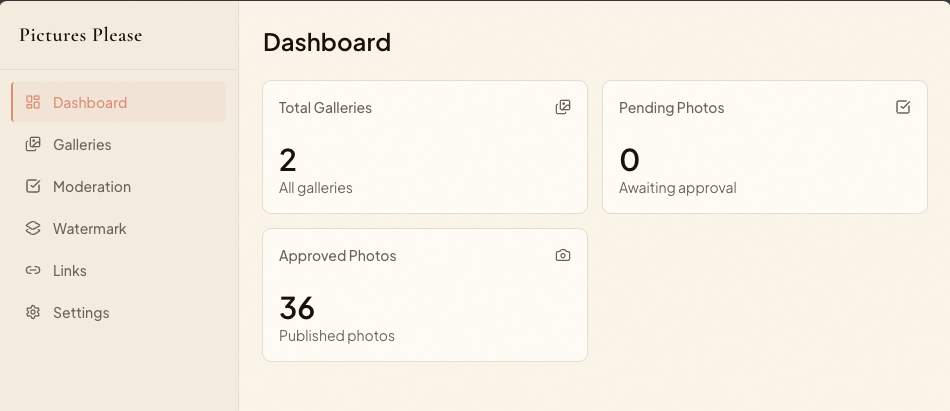
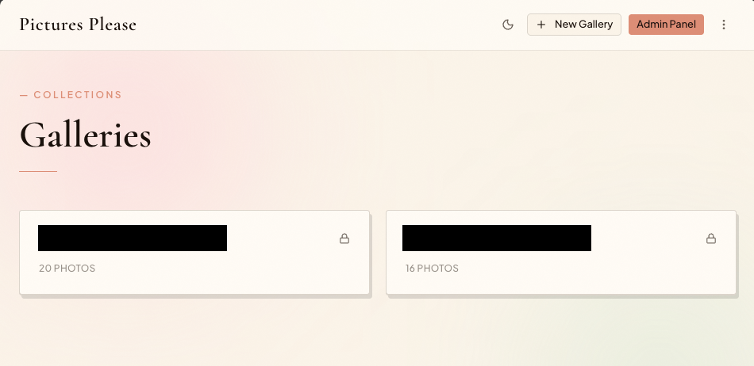
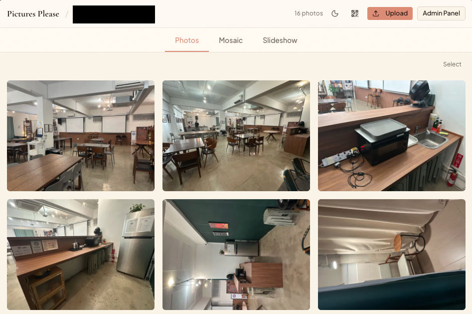

# Photo Gallery

A self-hosted photo gallery web application built with Next.js, deployed via Docker Compose.

## Features

- **Multiple display modes**: Masonry, Mosaic and Slideshow
- **Photo upload** configurable per gallery
- **QR code** generation for upload page links (dynamic — no hardcoded domains)
- **Admin panel**: approve/reject photos, manage galleries, global settings
- **Gallery passwords**: optional per-gallery password protection
- **Approval workflow**: configurable per gallery (bypass available)
- **Mobile-friendly**: responsive design, touch swipe gestures, iOS Safari compatible
- **Fully self-hosted**: PostgreSQL + local filesystem storage, no cloud dependencies

### Admin Panel


### Landing Page


### Gallery


## Quick Start

### 1. Configure environment

```bash
cp .env.example .env
cp docker-compose.example.yml docker-compose.yml
```

Edit `.env`:

```env
DB_PASSWORD=your_strong_db_password
ADMIN_USERNAME=admin
ADMIN_PASSWORD=your_admin_password
SESSION_SECRET=your_random_32_char_secret_string
APP_PORT=3000
```

### 2. Deploy with Docker Compose

```bash
docker compose up -d --build
```

The app will be available on the port you configured (default: 3000).

### 3. Configure Nginx Proxy Manager

Point your subdomain to `http://your-server-ip:3000`.

Ensure Nginx forwards these headers (enables dynamic QR code URLs):
```
X-Forwarded-Host: $host
X-Forwarded-Proto: $scheme
X-Forwarded-For: $proxy_add_x_forwarded_for
```

## Admin Access

Navigate to `/login` and sign in with your `ADMIN_USERNAME` and `ADMIN_PASSWORD`.

## Architecture

- **Framework**: Next.js 16 (App Router, standalone output)
- **Database**: PostgreSQL 16 (via Prisma ORM + pg adapter)
- **Storage**: Local filesystem Docker volume
- **Auth**: iron-session (encrypted cookies)
- **Image processing**: Sharp (server-side thumbnails)

## Development

```bash
npm install
npx prisma generate
# Set DATABASE_URL in .env pointing to local Postgres
npx prisma migrate dev
npm run dev
```

## Updating

```bash
docker compose --env-file .env.prod up -d --build
```
or
```bash
docker compose restart
```
Prisma migrations run automatically on container startup.
