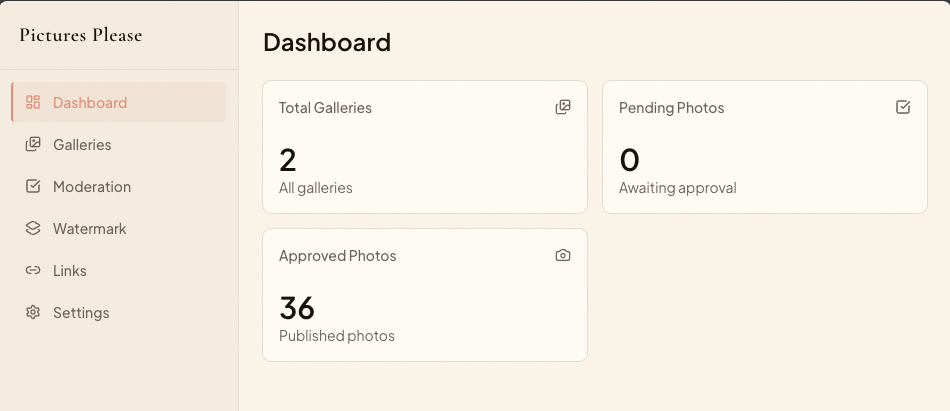
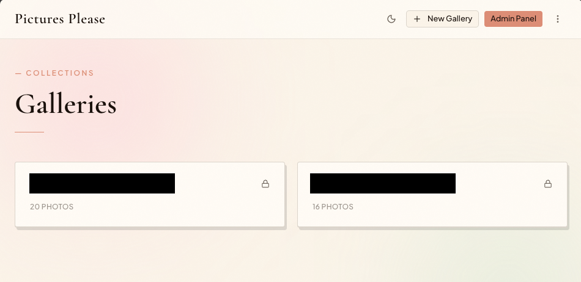
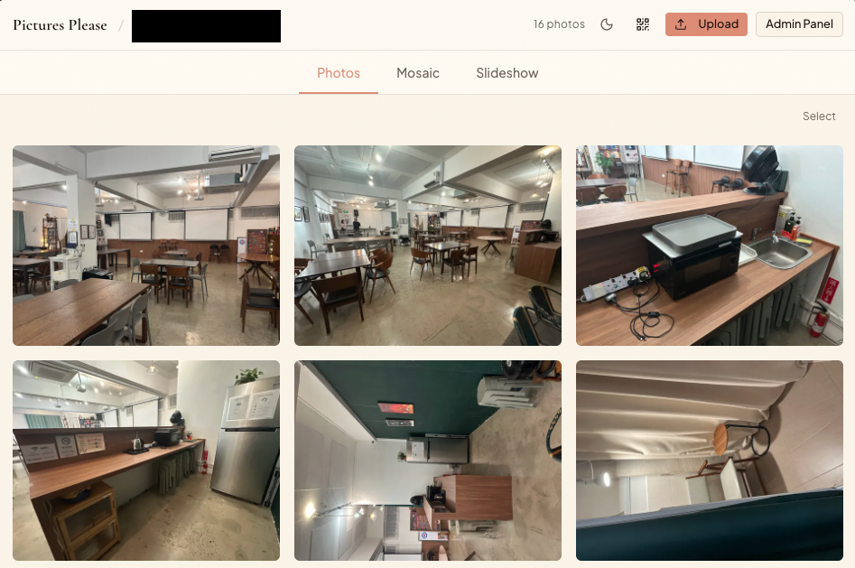

# Photo Gallery

A self-hosted photo gallery web application built with Next.js, deployed via Docker Compose.

## Features

- **Multiple display modes**: Masonry, Mosaic, and Slideshow — switchable per visit
- **Lightbox viewer**: full-screen photo browsing with keyboard and swipe navigation
- **Photo upload**: configurable per gallery with optional approval workflow
- **QR code** generation for upload page links (dynamic — no hardcoded domains)
- **Admin panel**: approve/reject photos, manage galleries, global settings
- **Gallery passwords**: optional per-gallery password protection
- **Gallery visibility**: show or hide individual galleries from the public listing
- **User-created galleries**: optionally allow any visitor to create a new gallery
- **Dark/light mode**: theme toggle available site-wide
- **Mobile-friendly**: responsive design, touch swipe gestures, iOS Safari compatible
- **Fully self-hosted**: PostgreSQL + local filesystem storage, no cloud dependencies

### Admin Panel


### Landing Page


### Gallery


## Quick Start

### 1. Configure environment

```bash
cp .env.example .env
cp docker-compose.example.yml docker-compose.yml
```

Edit `.env`:

```env
DB_PASSWORD=your_strong_db_password
ADMIN_USERNAME=admin
ADMIN_PASSWORD=your_admin_password
SESSION_SECRET=your_random_32_char_secret_string
APP_PORT=3000

# Optional: URL of a custom favicon image (leave blank to use the default camera icon)
# FAVICON_URL="https://example.com/my-icon.png"
```

### 2. Deploy with Docker Compose

```bash
docker compose up -d --build
```

The app will be available on the port you configured (default: 3000).

### 3. Configure Nginx Proxy Manager

Point your subdomain to `http://your-server-ip:3000`.

Ensure Nginx forwards these headers (enables dynamic QR code URLs):
```
X-Forwarded-Host: $host
X-Forwarded-Proto: $scheme
X-Forwarded-For: $proxy_add_x_forwarded_for
```

## Admin Access

Navigate to `/login` and sign in with your `ADMIN_USERNAME` and `ADMIN_PASSWORD`.

## Architecture

- **Framework**: Next.js 16 (App Router, standalone output)
- **Database**: PostgreSQL 16 (via Prisma ORM + pg adapter)
- **Storage**: Local filesystem Docker volume
- **Auth**: iron-session (encrypted cookies)
- **Image processing**: Sharp (server-side thumbnails), CropperJS (client-side crop)
- **UI**: shadcn/ui, Tailwind CSS, Framer Motion

## Development

```bash
npm install
npx prisma generate
npx prisma migrate dev
npm run dev
```

## Updating

```bash
docker compose up -d --build
```
If reloading .env file:
```bash
docker compose restart
```
Prisma migrations run automatically on container startup.

## Performance & Deployment Tuning

### Environment variables

| Variable | Default | Description |
|---|---|---|
| `UV_THREADPOOL_SIZE` | `4` | libuv thread pool size used by Sharp/libvips. Set to the number of vCPUs available to the container. |
| `NODE_OPTIONS` | `--max-old-space-size=512` | Caps Node.js heap at 512 MB. Raise to `768` or `1024` if you have spare RAM and upload large files frequently. |
| `UPLOAD_PROCESS_CONCURRENCY` | `2` | Max simultaneous Sharp image-processing jobs. Keep ≤ `UV_THREADPOOL_SIZE`. |
| `DATABASE_POOL_SIZE` | `20` | Max pg connections per process. Keep below Postgres `max_connections`. |

### Docker Desktop on Windows (WSL2)

By default WSL2 uses half the host's RAM and all CPU cores. For a self-hosted gallery you may want to pin these in `%UserProfile%\.wslconfig`:

```ini
[wsl2]
processors=4
memory=4GB
swap=2GB
```

After editing, run `wsl --shutdown` in PowerShell and restart Docker Desktop.

### Cloudflare (dashboard settings — cannot be set in code)

1. **Cache images at the edge** — *Rules → Cache Rules → Create rule*
   - **Match**: URI Path `starts with` `/api/uploads/`
   - **Cache**: "Cache Everything"
   - **Edge TTL**: "Respect existing headers" (the app already sends `Cache-Control: immutable`)
   - This serves thumbnails and originals directly from Cloudflare's CDN, offloading bandwidth from your home/VPS connection.

2. **Avoid 524 timeout on large uploads** — *Rules → Configuration Rules* (or zone-level *Settings → Network → Proxy Read Timeout*)
   - Set **Proxy Read Timeout** to **120 seconds** (default is 100 s, which can cause a Cloudflare 524 error mid-upload on slow connections).

3. **Request body size** — Cloudflare's free/pro plan allows up to 100 MB per request, which is already well above the app's 20 MB file limit. No change needed.
